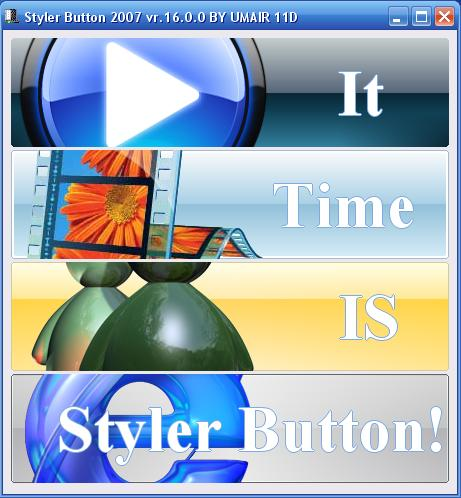



## Styler Button 2007 16\.00

### Description

Styler Button 2007 16.00 is Very Quick, Powerful &amp; New styles Botton.Styler Button 2007 enables you to customize the appearance of your applications to suit your individual needs.Styler Button Bring New Features Caption Alignment,Caption Effect Colour,Caption Offset X/y,Caption Shadow Offset X/y,Icon Alignment,Transparency Icon Value,Focused Dotted Rect,Button Rounded Value,Them &amp; All features in common button(Including events,properties).

I am PAKISTANI.MY LANGUAGE IS URDU.Sorry my bad English. for more informtion About form

I Used "FYI: 32bpp DIB Suite" in icon.Put your image(.bmp / *.gif / *.jpg / *.ico / *.png / *.wmf / *.emf / *.cur / *.jpeg) Source in "IconSource" Then Select "Icon" Chose "true" value.

I Thanks to FYI: 32bpp DIB Suite "AUTHOR"
 
### More Info
 

             |
---                |---
**Submitted On**   |2007-03-11 17:19:40
**By**             |[Muhammad Umair 11D](https://github.com/Planet-Source-Code/PSCIndex/blob/master/ByAuthor/muhammad-umair-11d.md)
**Level**          |Advanced
**User Rating**    |5.0 (40 globes from 8 users)
**Compatibility**  |VB 6\.0
**Category**       |[Custom Controls/ Forms/  Menus](https://github.com/Planet-Source-Code/PSCIndex/blob/master/ByCategory/custom-controls-forms-menus__1-4.md)
**World**          |[Visual Basic](https://github.com/Planet-Source-Code/PSCIndex/blob/master/ByWorld/visual-basic.md)
**Archive File**   |[Styler\_But2053723142007\.zip](https://github.com/Planet-Source-Code/muhammad-umair-11d-styler-button-2007-16-00__1-68136/archive/master.zip)

